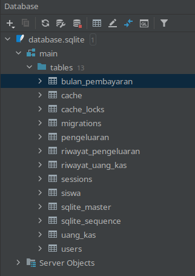

# Разбор проекта

## Установка проекта
- ``composer install``. В процессе установки может потребоваться файл ``/LANKAS/database/database.sqlite``. 
Создаем ее с помощью ``PhpStorm`` и повторяем  ``composer install``.
- Запускаю миграции ``php artisan migrate`` после чего появляются таблицы
  


## Функциональные возможности проекта
- Имеется событие ``BulanPembayaranDitambahkan`` которое запускается при сохранение модели в контроллере и 
обрабатывается в ``IsiUangKasUntukBulanBaru``. Данное событие связано с очередями с помощью трейтов
``Dispatchable``, ``SerializesModels``.
- Имеются модели данных. Описано как нужно, со связями
- Имеются контроллеры. Имеется метод генерации и загрузки ``pdf``
```php 
        $pdf = Pdf::loadView('laporan.pdf', [
            'bulan' => $bulan,
            'pemasukan' => $pemasukan,
            'pengeluaran' => $pengeluaran,
        ]);

        return $pdf->download('laporan_bulanan.pdf'); 
```

